<div align="left"> <a href="./README.md">🇫🇷 Français</a> | <a href="./README.en.md">🇬🇧 English</a> </div>

***

<a name="top"></a>

<div align="center">
  
  
  
  
  
  
  <h1>Assistant IA de gestion des connaissances techniques (RAG + RCA)</h1>
  
  <p>Assistant conversationnel on‑premise pour SOLENT, basé sur un pipeline RAG avancé (RAG‑Fusion + Self‑RAG) et un module d’analyse de cause racine (RCA) connecté à Redmine.</p>
  
</div>

# [Video Démonstration](https://drive.google.com/file/d/1-ywtd9EggAKQTIJjwxZUoYZfcXjqBXJq/view?usp=sharing)
Si le lien ne marche pas, considérez de copier lien et de le coller dans la barre de recherche.


***

## Table des matières

1. [Introduction](#introduction)
2. [Fonctionnalités clés](#features)
3. [Technologies utilisées](#tech)
4. [Installation et exécution](#installation)
5. [Architecture RAG / RCA](#archi)
6. [Perspectives et améliororations](#future)

***

## Introduction<a name="introduction"></a>

Ce projet propose un assistant de **gestion des connaissances techniques** permettant d’interroger de la documentation, du code et des tickets Redmine via une interface de chat RAG et un module d’analyse de cause racine (RCA).
La solution est conçue pour être déployée entièrement on‑premise, avec modèles de langage, embeddings et base vectorielle exécutés localement, afin de respecter les contraintes de confidentialité de SOLENT.

<div align="right">
  <a href="#top">⬆ Retour en haut</a>
</div>

***

## Fonctionnalités clés<a name="features"></a>

### Chat RAG documentaire

- Question‑réponse en langage naturel sur la documentation technique, le code et les tickets Redmine.
- Affichage des passages sources utilisés (chunks) avec méta‑données et scores de similarité pour assurer une traçabilité complète des réponses.


### RAG‑Fusion et Self‑RAG

- RAG‑Fusion déterministe : génération de requêtes multiples, recherche parallèle dans ChromaDB, fusion des résultats par Reciprocal Rank Fusion (RRF) et déduplication stricte des chunks.
- Self‑RAG côté backend : gating de la génération basé sur le nombre de chunks, le score moyen de similarité et le volume de contexte, avec refus explicite de réponse si le contexte est insuffisant.


### Intégration Redmine

- Connecteur Redmine complet : récupération des issues, wiki, documents, fichiers joints, versions, membres et métadonnées via l’API REST.
- Ingestion automatique d’un projet Redmine (issues + artefacts associés) puis indexation dans ChromaDB pour être exploités par le RAG et la RCA.


### Analyse de cause racine (RCA)

- Formulaire dédié où l’utilisateur colle un message d’erreur ou décrit un incident technique.
- Retrieval orienté RCA, privilégiant les chunks issus des issues Redmine, du code et des artefacts techniques, puis génération d’un rapport synthétique (symptômes, causes racines, actions correctives, mesures préventives).


### Ingestion multi‑sources

- Ingestion de fichiers (PDF, DOCX, PPTX, TXT, JSON, code, etc.), d’archives ZIP de projets et de contenus Redmine.
- Pipeline de parsing et chunking modulaire, avec parseurs spécialisés (PDF, code, documents bureautiques, formats structurés) et chunkers adaptés au texte et au code.

<div align="right">
  <a href="#top">⬆ Retour en haut</a>
</div>

***

## Technologies utilisées<a name="tech"></a>

<div align="center">
  
  
  
  
</div>

- **Backend** : FastAPI (API REST, endpoints RAG/RCA/ingestion).
- **Frontend** : Streamlit (chat RAG, page RCA, interface d’ingestion, health‑check backend).
- **Base vectorielle** : ChromaDB, index HNSW avec similarité cosinus.
- **Embeddings** : Jina AI embeddings v3 (modèle multilingue orienté retrieval, 1024 dimensions).
- **LLM** : modèle local via Ollama (par exemple `qwen2.5:3b` recommandé et validé pour ce projet).

<div align="right">
  <a href="#top">⬆ Retour en haut</a>
</div>

***

## Installation et exécution<a name="installation"></a>

### 1. Cloner le dépôt

```bash
git clone https://github.com/AchrafEssaleh/AI-Assistant-for-Technical-Knowledge-Management.git
cd AI-Assistant-for-Technical-Knowledge-Management
```

### 2. Prérequis

- Python 3.10 ou supérieur (macOS / Linux / Windows).
- Navigateur moderne pour accéder à l’interface Streamlit.


### 3. Créer et activer un environnement virtuel

Depuis la racine du projet, il faut créer un venv dans chaque sous-dossier (backend et frontend) puis l’activer en se plaçant dedans.


### macOS / Linux :

Depuis la racine du projet ouvrir un terminal

#### Backend
```bash
cd backend
python3 -m venv venv
source venv/bin/activate
```

Ouvrir un deuxième terminal

#### Frontend
```bash
cd frontend
python3 -m venv venv
source venv/bin/activate
```

### Windows :

Depuis la racine du projet ouvrir un terminal

#### Backend
```bash
cd backend
python3 -m venv venv
venv\Scripts\activate
```

Ouvrir un deuxième terminal

#### Frontend
```bash
cd frontend
python3 -m venv venv
venv\Scripts\activate
```

### 4. Installer les dépendances

Backend :

 Dans le terminal du backend
 
```bash
pip install -r requirements.txt
```

Frontend :

Dans le terminal du frontend 

```bash
pip install -r requirements.txt
```

Ces dépendances incluent notamment FastAPI, ChromaDB, LlamaIndex, Jina embeddings et Streamlit.

### 5. Installer Ollama

- macOS : https://ollama.com/download/mac
- Windows : https://ollama.com/download/windows

Ollama permet d’exécuter les modèles LLM localement.

### 6. Télécharger le modèle LLM recommandé

Une fois Ollama installé, Ouvrir un troisième terminal

```bash
ollama pull qwen2.5:3b
```

Le pipeline est compatible avec d’autres modèles Ollama, mais `qwen2.5:3b` a été validé dans le cadre du projet.

### 7. Configurer les variables d’environnement

Un fichier **`.env` est déjà présent à la racine du projet**.

**Il n'est pas nécessaire de créer un nouveau fichier `.env`.**

Vous devez uniquement **modifier les paramètres existants si nécessaire**, par exemple :

```env
REDMINE_URL=http://localhost:3000
REDMINE_API_KEY=9fd3becfae03e9af25016b50f623d08224fe38ff
LLM_BASE_URL=http://127.0.0.1:11434 
LLM_MODEL=qwen2.5:3b 
LLM_TEMPERATURE=0 
LLM_TIMEOUT=180
RAG_FUSION_ENABLED=1
RAG_FUSION_RRF_K=60
```

Ces variables pilotent la connexion au LLM local, l’activation de RAG‑Fusion et la connexion au projet Redmine.

### 8. Lancer le serveur Ollama

Dans le troisième terminal

```bash
ollama serve
```

Le serveur doit rester actif pendant toute l’exécution de l’assistant.

### 9. Lancer l’API FastAPI

Dans le premier terminal dédié au backend (avec l’environnement virtuel activé) :

```bash
uvicorn app.main:app --reload
```

- API FastAPI : http://127.0.0.1:8000
- Documentation OpenAPI : http://127.0.0.1:8000/docs

L’API expose les endpoints de chat RAG, RCA, ingestion de fichiers, ingestion d’archives et ingestion Redmine.

### 10. Lancer l’interface Streamlit

Dans le deuxième terminal dédié au frontend (toujours avec l’environnement virtuel activé) :

```bash
streamlit run streamlit_app.py
```

- Interface utilisateur Streamlit : http://localhost:8501

La barre latérale permet d’accéder au chat RAG, à l’analyse RCA et à la page d’ingestion de données.

<div align="right">
  <a href="#top">⬆ Retour en haut</a>
</div>


## Perspectives et améliororations<a name="future"></a>

- Intégration d’un parsing avancé des images (diagrammes, captures d’écran) via OCR et modèles de vision afin d’enrichir la base de connaissances.
- Passage vers des embeddings structurés par graphe pour mieux modéliser les relations entre tickets, documents, utilisateurs et composants techniques.
- Évolution vers un **agent IA** capable d’atteindre des objectifs (ex. prioriser des tickets, générer des rapports Redmine) plutôt qu’un simple chatbot question‑réponse.
- Conteneurisation complète (Docker) et automatisation du déploiement pour faciliter l’industrialisation de la solution chez SOLENT.

<div align="right">
  <a href="#top">⬆ Retour en haut</a>
</div>


---

## Démo<a name="demo"></a>

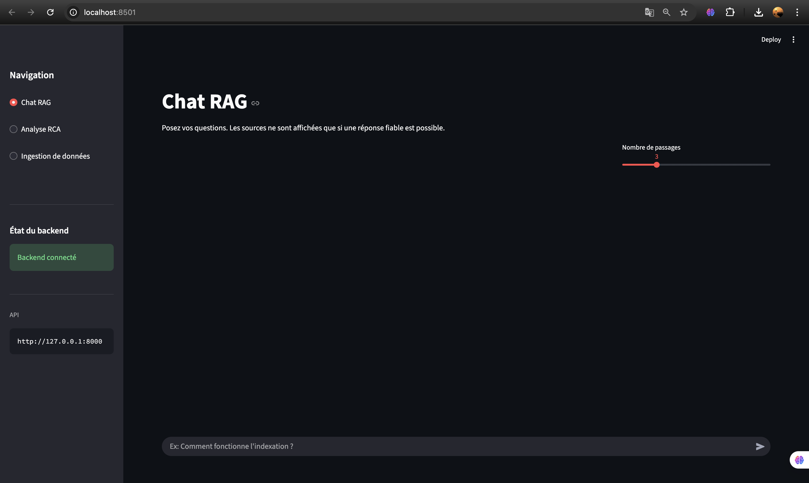
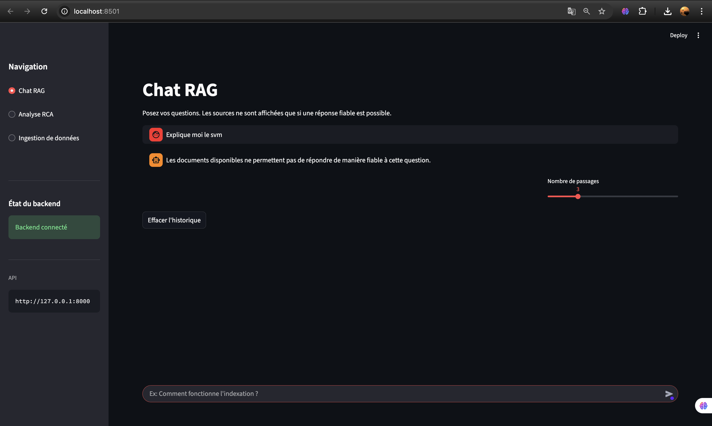
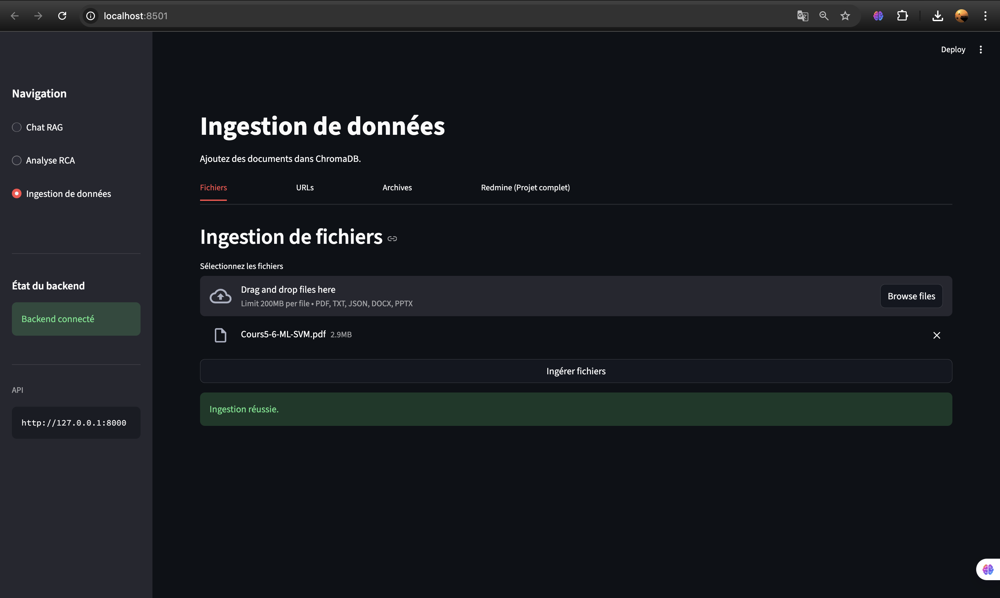
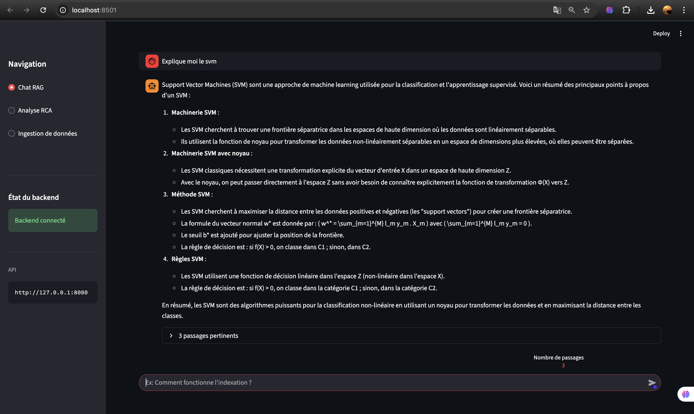
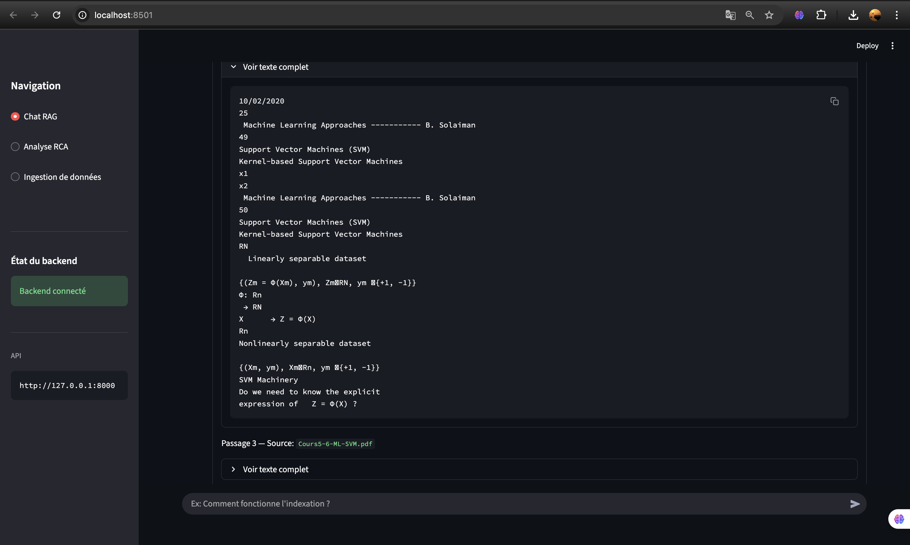
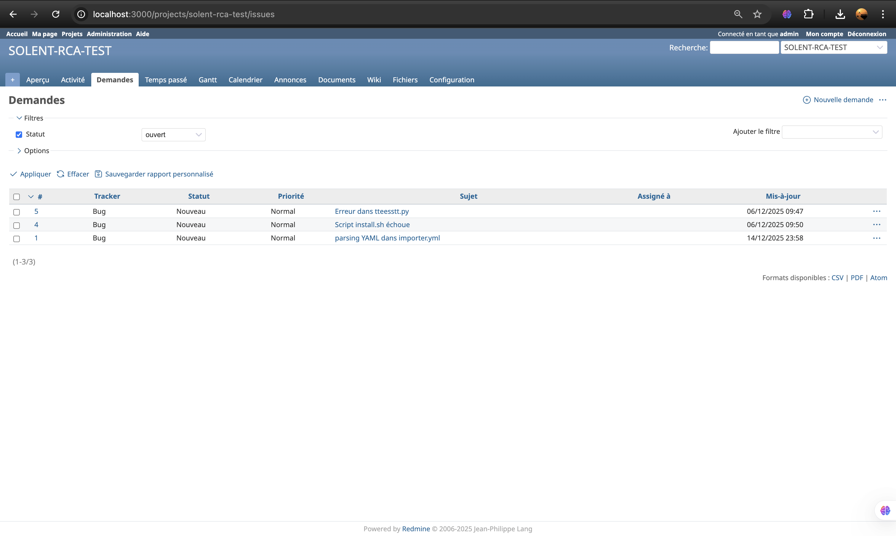
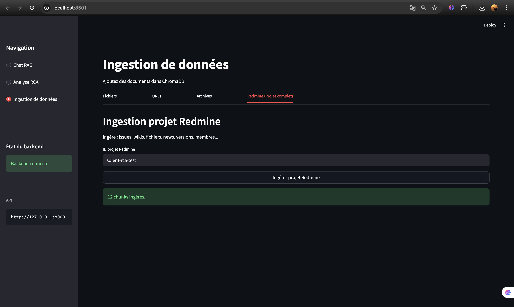
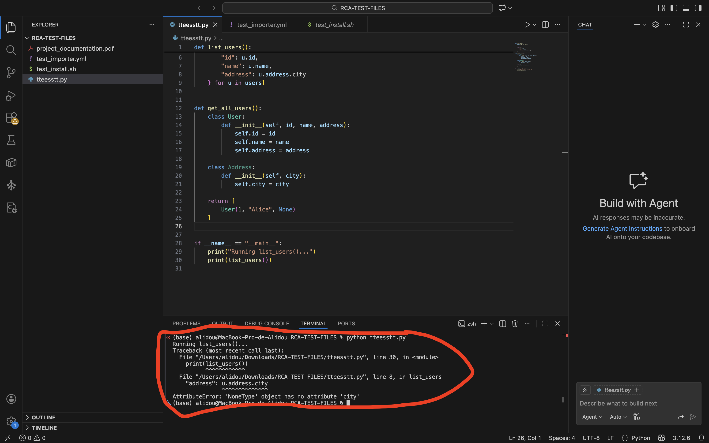
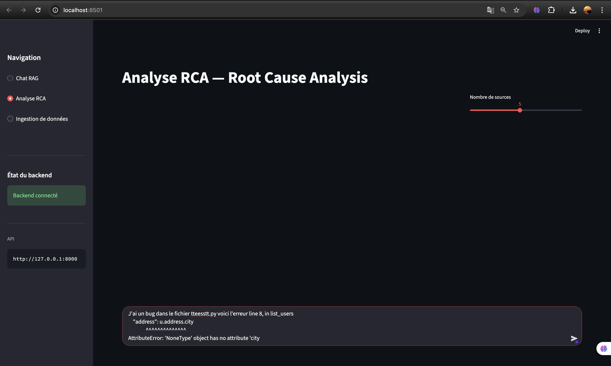
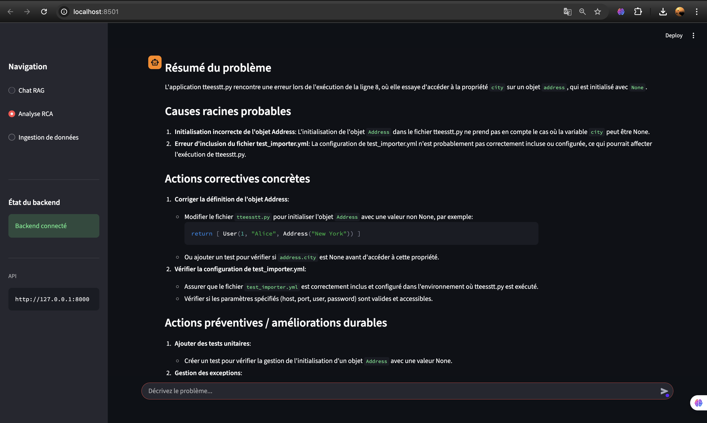
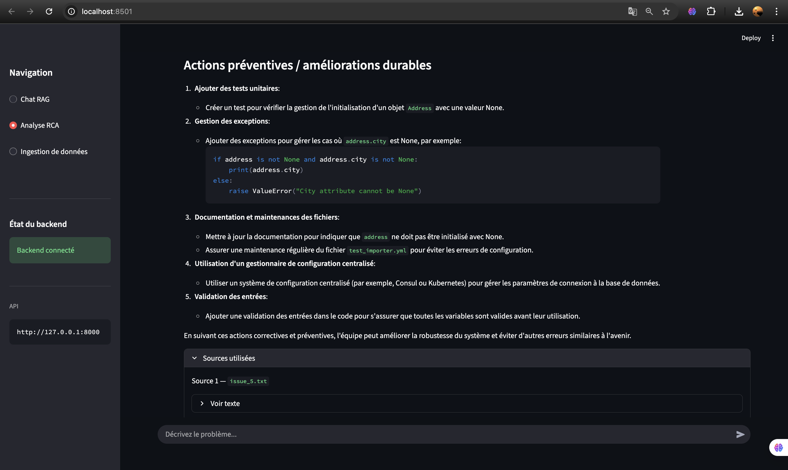
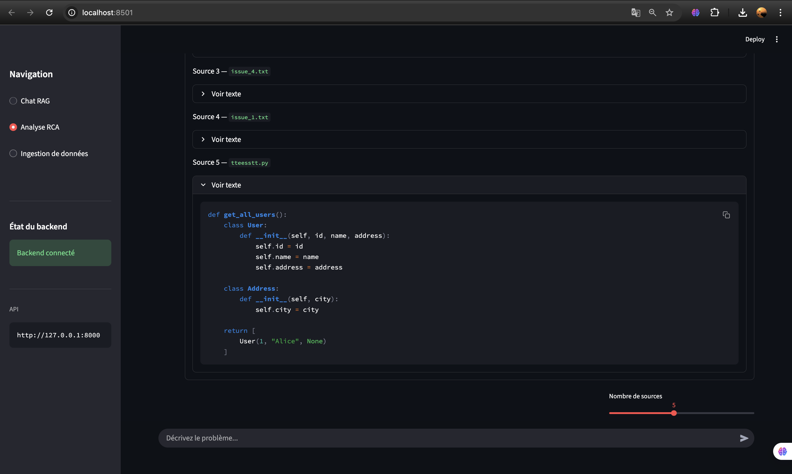


<div align="right"> <a href="#top">⬆ Retour en haut</a> </div>


